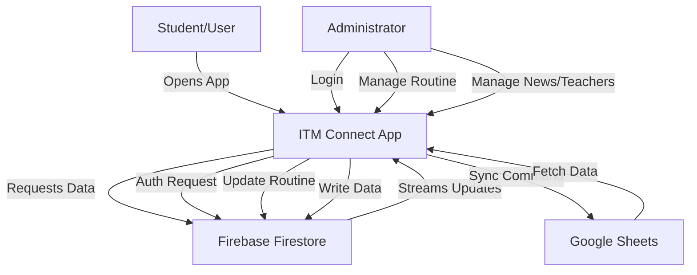

# ITM Connect - Project Proposal & Documentation

## 1. Project Overview
**Project Name:** ITM Connect  
**Platform:** Cross-Platform Mobile Application (Android, iOS) & Web  
**Developed With:** Flutter (Frontend), Firebase (Backend/Auth/Database)  
**Target Audience:** Students, Faculty, and Administration of the Department of Information Technology & Management (ITM), Daffodil International University.

### 1.1 Executive Summary
"ITM Connect" is the centralized digital hub for the Department of Information Technology & Management. It bridges the communication gap between the department administration and students. The application provides an open-access portal for students to view class routines, faculty profiles, notices, and department news, while offering a secured administration panel for managing this dynamic content in real-time.

---

## 2. System Requirements Specification (SRS)

### 2.1 Functional Requirements

#### **User Panel (Student/Guest - Open Access)**
*   **Landing Screen:** Animated entry with "Get Started" navigation.
*   **Home Dashboard:**
    *   **Department Info:** Welcome message from Head of Department, department statistics (Students, Faculty, Courses).
    *   **Live News Feed:** Real-time news updates with images and links (e.g., Facebook posts).
    *   **Quick Links:** Access to Student Portal, Digital Library.
*   **Teacher Directory:** View list of faculty members with profiles, images, and consulting hours.
*   **Class Routine:** View daily class schedules, filterable by batch/day.
*   **Notice Board:** View official departmental notices.
*   **Contact & Location:** View department contact details and Google Maps location.
*   **Feedback System:** Submit anonymous or named feedback to the department.

#### **Admin Panel (Secured Access)**
*   **Authentication:**  
    *   Secure Email/Password Login.
    *   Security features: Brute-force protection (lockout after 5 failed attempts), Input validation (SQLi/XSS prevention).
*   **Dashboard:** Overview of system status.
*   **Content Management:**
    *   **Manage Teachers:** Add, update, delete faculty profiles.
    *   **Manage Routines:** Create/Edit routines manually or sync user data from **Google Sheets**.
    *   **Manage Notices:** Post and remove important announcements.
    *   **Manage News:** Publish news articles with images.
    *   **Manage Feedback:** View and review student feedback.
    *   **Manage Exam Routines:** Specialized section for exam scheduling.

### 2.2 Non-Functional Requirements
*   **Performance:** The app uses real-time `Streams` to ensure data updates instantly without page refreshes.
*   **Scalability:** Built on Firebase Firestore, allowing it to handle thousands of concurrent users.
*   **Security:** 
    *   Admin panel is protected by Firebase Authentication.
    *   Input sanitization is implemented on login forms.
*   **Usability:** Modern, responsive UI with animations (`flutter_animate`) and glassmorphism effects.

---

## 3. System Design & Architecture

### 3.1 Technology Stack
*   **Frontend Framework:** Flutter (Dart)
*   **Backend as a Service (BaaS):** Firebase
    *   **Authentication:** Firebase Auth (Admin access)
    *   **Database:** Cloud Firestore (NoSQL, Real-time)
*   **External Integrations:**
    *   **Google Sheets API:** For bulk routine management/sync.
    *   **Google Maps SDK:** For location services.
    *   **Url Launcher:** For opening external links (Facebook, Portals).

### 3.2 Data Flow Diagram (DFD)



### 3.3 Database Schema (Firestore)

**Collection: `teachers`**
*   `id` (docId): Unique identifier
*   `name`: String
*   `email`: String
*   `role`: String (e.g., Lecturer, Professor)
*   `imageUrl`: String (URL)
*   `teacherInitial`: String (e.g., "TAT")
*   `consultingHour`: String

**Collection: `routines`**
*   `id` (docId): e.g., "60_Sat" (Batch_Day)
*   `batch`: String
*   `day`: String
*   `teacherInitial`: String
*   `classes`: Array of Objects
    *   `courseName`: String
    *   `courseCode`: String
    *   `room`: String
    *   `time`: String
    *   `teacherInitial`: String

**Collection: `news`**
*   `id` (docId): Unique identifier
*   `title`: String
*   `body`: String
*   `date`: String
*   `imageUrl`: String
*   `facebookUrl`: String

**Collection: `notices`** (Inferred)
*   `id`: String
*   `title`: String
*   `description`: String
*   `date`: Timestamp

---

## 4. Project Structure
The project follows a **Feature-First** architecture combined with a `services` layer for data logic.

```text
lib/
├── app/
│   └── app.dart               # Main app configuration (Theme, Routes)
├── features/                  # Feature-based organization
│   ├── admin/                 # All Admin-related screens
│   │   ├── dashboard/
│   │   ├── login/             # Secure Login Logic
│   │   ├── manage_exam_routines/
│   │   ├── manage_feedback/
│   │   ├── manage_news/
│   │   ├── manage_notices/
│   │   ├── manage_routines/   # Routine CRUD & Google Sheets Sync
│   │   └── manage_teachers/
│   ├── landing/               # Intro Animation Screen
│   ├── shared/                # Shared UI (Drawers, etc.)
│   └── user/                  # All Student-facing screens
│       ├── class_routine/
│       ├── contact/
│       ├── drawer/
│       ├── feedback/
│       ├── home/              # Main User Dashboard
│       ├── notice/
│       ├── teacher/
│       └── webview_demo/
├── models/                    # Data Models (Dart Classes)
│   ├── feedback.dart
│   ├── news.dart
│   ├── routine.dart
│   └── teacher.dart
├── services/                  # Business Logic & API Calls
│   ├── exam_routine_service.dart
│   ├── feedback_service.dart
│   ├── google_sheet_service.dart  # Google Sheets Integration
│   ├── news_service.dart
│   ├── notice_service.dart
│   ├── routine_service.dart
│   ├── teacher_service.dart
│   └── pdf_download_service.dart
├── widgets/                   # Reusable UI Components
│   ├── admin_app_layout.dart
│   ├── app_layout.dart
│   ├── custom_button.dart
│   └── webview_widget.dart
├── firebase_options.dart      # Firebase Configuration
├── main.dart                  # Application Entry Point
└── routes.dart                # Route Definitions
```

## 5. Deployment & Setup

### Prerequisites
1.  Flutter SDK installed.
2.  Firebase Project configured.
3.  `google-services.json` (Android) and `GoogleService-Info.plist` (iOS) placed in respective folders.
4.  Google Cloud Console API Key enabled for **Google Sheets API** (service account credentials in `assets/itm-connect-credentials.json` if used).

### Installation
1.  Clone Repository.
2.  Run `flutter pub get`.
3.  Run `flutter run`.

## 6. Future Scope
*   **Push Notifications:** Notify students about routine changes or new notices instantly.
*   **Student Login:** Personalized dashboard (my routine only, my grades).
*   **Offline Mode:** Cache routine and notices for offline access using Hive or SQLite.
